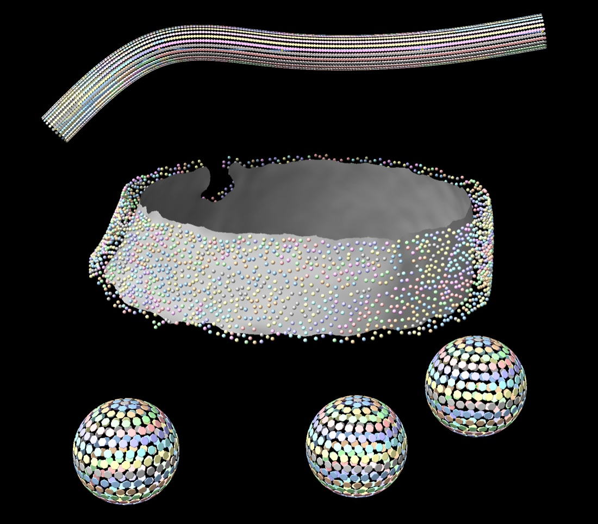

#  Geopickr

*A ChimeraX bundle for geometric particle picking in cryo-electron tomography.*



<sub>*Temporary splash image — placeholder, to be replaced.*</sub>

**Source / issues:** https://github.com/baradlab/Geopickr

Geopickr brings the subtomogram-averaging *picking* pipeline into one tabbed
ChimeraX tool. It is a **fork and port** of three UCSF Chimera plugins written
by **Kun Qu in the laboratory of John Briggs** (originally MRC LMB /
Heidelberg, now Max Planck Institute of Biochemistry):

1. **Place Points** — mark sphere centres / tube & filament axes on a tomogram
   (a thin helper over ChimeraX's native marker tools; replaces the Volume
   Tracer step).
2. **Geometry Picker** — geometrically sample evenly-spaced particle positions
   and orientations on **spheres, tubes, filaments, or arbitrary surface
   meshes**, producing a 20×N TOM/AV3 motive list. (Ports *Pick Particle*.)
3. **Place Object** — display a motive list as placed objects, coloured by class
   or cross-correlation. (Ports *Place Object*.)

This bundle **ports these tools from UCSF Chimera to UCSF ChimeraX, integrates
them into a single tabbed interface, and adds new functionality** (a filament
mode, arbitrary-surface picking, live per-object radius fitting, instanced
rendering, and STOPGAP `.star` export). It supersedes the original Chimera
plugins **Place Object 2.1.0** and **Pick Particle 2.0.0**.

> This is an independent, community fork. It is not produced or endorsed by the
> Briggs laboratory or UCSF. Please cite the original work (below) in any
> publication that uses this tool.

## Attribution & citation

Original author: **Kun Qu**, **Briggs laboratory**.
The original plugins are distributed under the GPL v3 and are described in:

- **Place Object** — Qu K., Glass B., Dolezal M., Schur F.K.M., Murciano B.,
  Rein A., Rumlova M., Ruml T., Kräusslich H.-G., Briggs J.A.G. (2018)
  *Structure and architecture of immature and mature murine leukemia virus
  capsids.* PNAS **115**:E11751–E11760.
- **Pick Particle** — Qu K., Ke Z., Zila V., Anders-Oesswein M., Glass B.,
  Mücksch F., Müller R., Schultz C., Müller B., Kräusslich H.-G., Briggs J.A.G.
  (2021) *Maturation of the matrix and viral membrane of HIV-1.* Science
  **373**:700–704.

The original Place Object / Pick Particle plugins remain © their authors and are
GPL v3; portions of the original code carry the UCSF Chimera copyright. This fork
preserves that licensing (see **License**). Geometry assets (`src/objects/*.stl`)
are carried over from the original Place Object plugin.

## What this fork changes / adds

- **Chimera → ChimeraX** port (Qt UI instead of Tkinter; native ChimeraX
  models, sessions, and commands).
- **Single tabbed tool** (ArtiaX-style) instead of three separate windows.
- **New geometry modes**: *Filament* (centreline + tangent orientation +
  optional helical twist) and *Surface* (area-weighted, Poisson-thinned sampling
  of any open OBJ/PLY/STL mesh). Sphere and Tube are faithful ports of Qu's maths.
- **Live radius fitting** — a single whole-model radius slider by default, or
  per-object sliders, updating the fit wireframes in real time.
- **Efficient instanced rendering** — one `Surface` + `Places` per motive list,
  scaling to tens of thousands of particles.
- **STOPGAP `.star` export** in addition to `.em`.

## Install

From source:

```
ChimeraX --nogui --exit --cmd "devel install /path/to/ChimeraX-Geopickr exit true"
```

or, once released, from the ChimeraX Toolshed (**Tools → More Tools…**) or:

```
toolshed install ChimeraX-Geopickr
```

Then open it from **Tools → Volume Data → Geopickr** — one window with
**Place Points**, **Geometry Picker**, and **Place Object** tabs.

## Quick start

1. **Place Points** tab: *New marker set* → *Mark on plane* → right-click VLP
   centres in the tomogram.
2. **Geometry Picker** tab: select the marker set → *Sphere* → set the *Radius*
   slider and *Tangential* spacing → *Show fit* (optionally tick *Per-object
   radii*) → *Pick*.
3. The particles appear in the **Place Object** tab; adjust shape/colour and
   *Save shown…* as `.em` or STOPGAP `.star`.

Command equivalent:

```
open spheres.cmm
pickparticle #2 style sphere radius 50 tangential 10
```

See the in-app help (`help:user/tools/pickparticle.html`) for full details of the
motive-list format and every control.

## Input / output formats

Geopickr currently reads and writes the formats used by the original Briggs-lab
pipeline:

| Purpose | Format | Read | Write |
|---|---|---|---|
| Markers (sphere centres / tube & filament axes) | Chimera marker XML (`.cmm`) | ✓ | ✓ (via the Markers tool) |
| Surface meshes for surface picking | any surface ChimeraX can open (`.obj`, `.ply`, `.stl`, volume isosurfaces, …) | ✓ | — |
| Motive list (particle positions/orientations) | TOM/AV3 EM (`.em`), 20×N matrix | ✓ | ✓ |
| STOPGAP star | STOPGAP (`.star`) | — | ✓ |
| **Dynamo table** | Dynamo (`.tbl`) + optional volume-list (`.vll`) hand-off | — | ✓ *(beta)* |
| **RELION 5** | RELION 5.1 particles star (centered Å, `rlnTomoSubtomogram*`) | — | ✓ *(beta)* |
| **RELION 3/4** | RELION 3/4 tomo star (pixel coords, `rlnAngleRot/Tilt/Psi`) | — | ✓ *(beta)* |

Use **Export…** in the Place Object or Geometry Picker tab, or the command
`geopickr export #model file <path> format <em|stopgap|dynamoTbl|relion5|relion3>
[onTomogram #vol] [tomoId n] [tomoName name] [vll <path>]`.

> **Coordinate units:** Dynamo `.tbl` needs voxel indices and RELION needs voxel/centered-Å
> coordinates, but Geopickr's particles live in ChimeraX scene units. Choose the source
> **tomogram Volume** in the Export dialog (or `onTomogram`) so coordinates are converted
> correctly (voxel size, box dimensions, origin read from the map). Without a Volume the
> coordinates are assumed to already be in voxels.

> **Beta:** the Dynamo/RELION **angle conventions are cross-validated against
> [ArtiaX](https://github.com/FrangakisLab/ArtiaX)** (Geopickr's exported Euler angles
> reproduce the same particle orientation through ArtiaX's own `DynamoEulerRotation` /
> `RELIONEulerRotation`). The **coordinate-origin conventions** (Dynamo 1-indexing, RELION 5
> centering at box/2) follow ArtiaX/standard usage but have **not yet been confirmed against a
> live Dynamo/RELION import** on real data. Please report mismatches (issues
> [#1](https://github.com/baradlab/Geopickr/issues/1),
> [#2](https://github.com/baradlab/Geopickr/issues/2)) with an example.

The 20-row `.em` motive-list layout follows the TOM/AV3 convention (CCC, tomogram
/feature indices, X/Y/Z coordinate + shift, ZXZ Euler angles, class); see the
in-app help for the exact rows.

**We want Geopickr to fit as many subtomogram workflows as possible.** If your
pipeline uses a coordinate/orientation format that isn't supported yet (e.g. a
different `.star` flavour such as RELION/Warp/M, Dynamo `.tbl`, IMOD `.mod`,
EMAN `.json`, plain text, …), please **open an issue at
https://github.com/baradlab/Geopickr/issues** with:

- a short description of the format and the tool/pipeline it comes from,
- a small **example file** (and, if relevant, the matching output it should
  produce), and
- the coordinate and angle conventions (handedness, units, rotation order,
  whether shifts are separate from coordinates).

Concrete examples make it far easier to add a format correctly, and we'd love to
grow the list of supported import/export options.

## License

GPL v3, following the original Place Object / Pick Particle plugins. See
[LICENSE](LICENSE).
